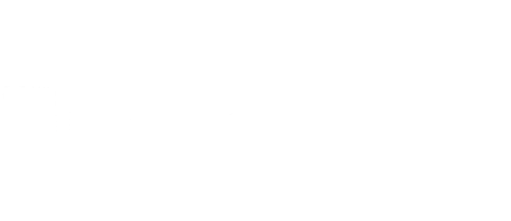

<<<<<<< HEAD

# Table of Contents

- [Table of Contents](#table-of-contents)
- [ECU-ZRE23](#ecu-zre23)
  - [Getting Started](#getting-started)
    - [Prerequisites](#prerequisites)
    - [Hardware](#hardware)
    - [OneDrive Documentation](#onedrive-documentation)
    - [Testing](#testing)
  - [Running unit tests](#running-unit-tests)
  - [Versioning](#versioning)
  - [License](#license)
  - [Acknowledgments](#acknowledgments)

# ECU-ZRE23

This repository contains the embedded firwmare for the ECU on ZRE23.  

## Getting Started

These instructions will get you a copy of the project up and running on your local machine for development and testing purposes. See deployment for notes on how to deploy the project on a live system.

1. If you are new to the team, read the onboarding document on the OneDrive: **/Engineering/Subsystems/Software/Oboarding/Software New Member Onboarding.docx**
   
2. Please also review our embedded software standards: **/Engineering/Design Standards/Embedded Software Standards.docx**
   
3. If you haven't already, please install the pre-requesite software below.

### Prerequisites

- [MPLAB X IDE](https://www.microchip.com/en-us/tools-resources/develop/mplab-x-ide#tabs)

- [MPLAB XC Compiler](https://www.microchip.com/en-us/tools-resources/develop/mplab-xc-compilers/xc16)

### Hardware
To compile your software and deploy it on our hardware, you will need the following hardware:

- DT00400-AA VCU PCB
- Compatible VCU test harness
- [MPLAB ICD 4 / ICD 5 In-Circuit Debugger](https://www.microchip.com/en-us/development-tool/dv164045#)
- RJ11 Cable (make sure it works)
- [Tag-Connect TC2030-MCP 6-Pin Cable](https://www.tag-connect.com/product/tc2030-mcp-6-pin-cable-with-rj12-modular-plug-for-microchip-icd)
- 12V Power supply

The project is setup to require external power to the board in order to program the microcontroller.

### OneDrive Documentation
- Additional hardware and system documentation for the VCU can be found on the OneDrive at **/Engineering/Subsystems/GLV Systems/Documentation/VCU**.

- Documentation for CAN bus system can be found at **/Engineering/Subsystems/GLV Systems/Documentation/ELA0002 Wiring Harness**.

### Testing

## Running unit tests

Unit testing of the VCU is currently not implemented.

## Versioning

At the end of each vehicle season, the repository is copied and renamed for the new vehicle. The old repository is then archived.

## License

This project is licensed under the MIT License - see the [LICENSE.md](LICENSE.md) file for details

## Acknowledgments

* [README-Template](https://gist.github.com/PurpleBooth/109311bb0361f32d87a2)